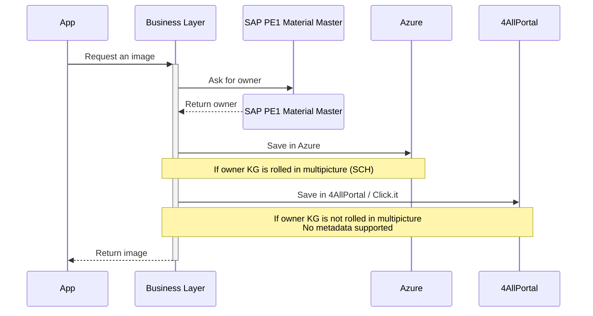

# Architecture

> [[index|WS3 Multipicture]]

This document presents and evaluates different architectural approaches for the project, considering the various systems that participate in the solution and the integration patterns required between them.

Since each system has its own capabilities, constraints, and security considerations, multiple options are examined to determine the most suitable architecture. The analysis focuses on how the components can interact effectively while meeting requirements related to performance, maintainability, security, and future extensibility.

## Requirements to be covered

- We need to store multiple images per spare part
- Additional information to be attached to the image as metadata: type of image, description, etc.
- Users should see those images in the different apps (iOS, Web, SAP ERP, etc.)
- Images should be available for [[glossary#VISP|VISP]]

### Nice to have

- Consolidate image storage systems
- Enhance security and recovery plans
- Reduce maintanability effort and improve resilience to changes
- Prepare for future scenarios: SAP Clean Core, migrations, platform changes

## Systems/functionalities needed

- Storage System for image binaries
- Metadata repository

## Proposals

---

### **BTP** as _Business Layer_ and **Azure** as _Storage_

#### Pros and Cons

🟢 Keep the business logic close to the master data without mixing responsibilities with the ERP
🟢 Follow Clean Core SAP recommendations
🟢 Authentication and authorization can leverage SAP BTP services (XSUAA, IAS, Principal Propagation)
🟢 Easier future migration from SAP ERP to S/4HANA thanks to loose coupling
🟢 Metadata and image storage can evolve independently from SAP backend systems
🟢 Store Images in Azure allowing the usage for VISP
🟡 More complex troubleshooting due to cross-platform integrations
🟡 Dependency on both SAP and Azure platform availability
🔴 Additional operational landscape (BTP + Azure + SAP)
🔴 BTP additional costs (based on licenses, traffic...?)

---

### **Azure** as _Business layer_ and _Storage_

#### Pros and Cons

🟢 Less API exposure if Private Links used in Azure
🟢 Direct access to Azure-native services (Functions, API Management, Event Grid, AI Services)
🟢 Store Images in Azure allowing the usage for VISP
🟢 Easier reuse of the API for non-SAP consumers and external partners
🟢 Easier future migration from SAP ERP to S/4HANA thanks to loose coupling
🟡 Ownership boundaries may become unclear between SAP and Azure teams
🔴 Additional integration with SAP environment required
🔴 SAP authorizations and business rules must be replicated or exposed externally
🔴 Additional Azure costs per additional service and traffic

#### Observation

This option is technically simple but tends to shift business ownership outside the SAP ecosystem. Over time that can create duplication of processes and authorization models.

---

### **4AllPortal** and **Azure** as _Storage_ alternatives

#### Pros and Cons

🟢 Lower disruption for KGs not yet participating in Multipicture
🟢 Allows phased adoption and gradual migration
🟡 Migration of data needed each time is rolled-in
🟡 Images not available for VISP until each KG is rolled-in
🟡 Additional reconciliation processes may be needed to avoid data inconsistencies
🔴 Risk of the temporary transition architecture becoming permanent
🔴 Additional logic to identify rolled-in KGs
🔴 Changes still required in all apps to adapt to the new model
🔴 Two sources of truth for image storage during rollout

---

## Architectural assessmnet

- BTP + Azure: Strategic option. Best alignment with Clean Core, S/4 readiness and SAP-centric architecture.

- Azure + Azure: Technology-driven option. Simpler from a cloud perspective but requires stronger SAP integration efforts.

- 4AllPortal + Azure: Transitional option. Allow incremental roll-outs. Still requires developments in all layers to support both _Storage_ options

| Criterion                 | BTP + Azure | Azure + Azure | 4AllPortal + Azure |
| :------------------------ | :---------- | :------------ | :----------------- |
| Clean Core alignment      | 🟢 High     | 🟡 Medium     | ~~~~               |
| SAP integration           | 🟢 High     | 🟡 Medium     | ~~~~               |
| VISP compatibility        | 🟢 High     | 🟢 High       | 🟡 Progressive     |
| Future S/4 readiness      | 🟢 High     | 🟡 Medium     | ~~~~               |
| Operational complexity    | 🟡 Medium   | 🟢 Low        | 🔴 High            |
| Long-term maintainability | 🟢 High     | 🟡 Medium     | 🔴 Low             |
