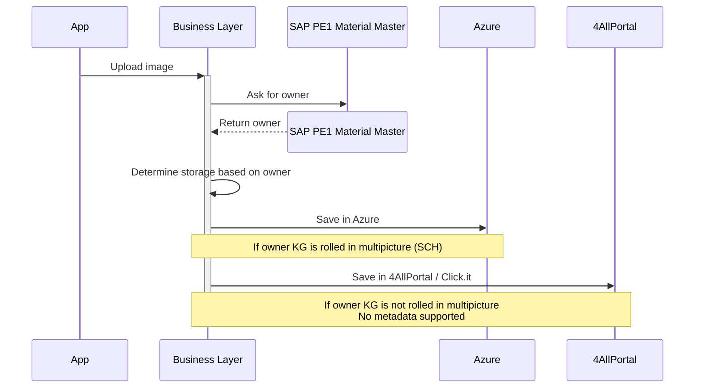

# Architecture

> [[index|WS3 Multipicture]]

This document presents and evaluates different architectural approaches for the project, considering the various systems that participate in the solution and the integration patterns required between them.

Since each system has its own capabilities, constraints, and security considerations, multiple options are examined to determine the most suitable architecture. The analysis focuses on how the components can interact effectively while meeting requirements related to performance, maintainability, security, and future extensibility.

## Requirements to be covered

### Functional requirements

- Support multiple images per spare part
- Store image-related metadata, such as image type, description and other future attributes
- Make images available across all consuming applications (iOS, Web, SAP ERP, etc.)
- Make images available for [[glossary#VISP|VISP]] consumption

### Non-functional requirements

- Decouple business logic from the underlying storage technology
- Support future storage migrations with minimal impact on consuming applications
- Ensure secure access and authorization management
- Provide a scalable and resilient solution for image storage and retrieval

### Nice to have

- Consolidate existing image storage systems
- Enhance security, backup and recovery capabilities
- Reduce maintenance effort and improve resilience to changes
- Prepare for future scenarios such as SAP Clean Core initiatives, ERP migrations and platform evolutions

## Proposals

---

### **BTP** as _Business Layer_ and **Azure** as _Storage_

#### Pros and Cons

🟢 Best alignment with SAP Clean Core and future S/4HANA evolution
🟢 Keeps business logic close to SAP while avoiding ERP customizations
🟢 Leverages SAP-native authentication and authorization capabilities
🟢 Enables image consumption from both SAP and non-SAP applications (VISP)
🔴 Higher operational complexity due to SAP, BTP and Azure integration
🟡 Requires expertise across multiple technology platforms

---

### **Azure** as _Business layer_ and _Storage_

#### Pros and Cons

🟢 Simpler technical landscape with a single cloud platform
🟢 Reduced external API exposure when Azure Private Links can be used
🟢 Enables image consumption from both SAP and non-SAP applications (VISP)
🔴 Business rules and authorizations must be replicated outside SAP
🔴 Additional integration effort with SAP systems and identities
🟡 Risk of business ownership gradually moving away from the SAP ecosystem

---

### **4AllPortal** and **Azure** as _Storage_ alternatives

#### Pros and Cons

🟢 Supports phased rollout and controlled adoption by KG
🟢 Preserves existing DAM processes during the transition
🔴 Two storage models must coexist during the rollout period
🔴 Increases implementation and maintenance complexity across all applications
🔴 Risk of the transitional architecture becoming permanent
🟡 VISP availability depends on migration progress

---

## Architectural assessment

| Criterion                 | BTP + Azure    | Azure + Azure  | 4AllPortal + Azure |
| :------------------------ | :------------- | :------------- | :----------------- |
| Clean Core alignment      | 🟢 High        | 🟡 Medium      | \*                 |
| Authorization governance  | 🟢 Centralized | 🔴 Distributed | \*                 |
| VISP compatibility        | 🟢 High        | 🟢 High        | 🟡 Progressive     |
| Future S/4 readiness      | 🟢 High        | 🟡 Medium      | \*                 |
| Operational complexity    | 🔴 High        | 🟢 Low         | 🔴 High            |
| Cross Platform dependency | 🟡 Medium      | 🟢 Low         | 🔴 High            |
| Long-term maintainability | 🟢 High        | 🟡 Medium      | 🔴 Low             |

\* _Depends on the Business Layer chosen architecture_

### Key risks

**BTP + Azure**

- Increased operational complexity due to the coexistence of SAP ERP, BTP and Azure platforms
- Costs distributed across multiple cloud environments, making long-term cost forecasting more difficult
- Increased dependency on cross-platform integrations for critical business processes

**Azure + Azure**

- Business rules and authorization models may gradually diverge from SAP standards and processes
- Additional effort may be required to keep SAP authorizations synchronized with Azure services
- SAP BTP might still be required for integration scenarios, reducing the expected platform simplification benefits

**4AllPortal + Azure**

- Increased development and operational effort to support dual storage models
- Risk of data inconsistencies between platforms during migration and rollout activities
- Schindler internal security assessment detected some risks related to 4AllPortal
- Dependency on external partners (Click-it and 4AllPortal). Non-extended support coverage and additional costs
