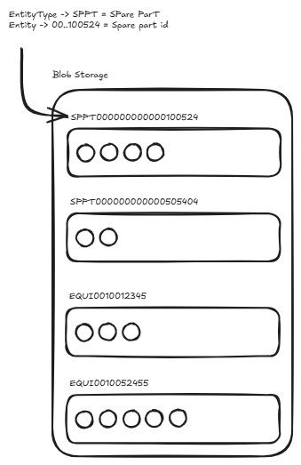
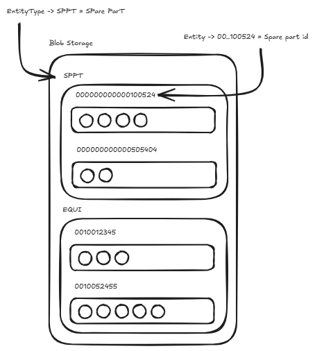

# Azure storage design

> [[index]]>[[ep1]]

## Requisites

The objective is to create a tool to store image binaries with the associated metadata.

The chosen platform is Azure with Blob Storage for the binaries and CosmosDB for the metadata.

This allows metadata queries without downloading image binaries and supports flexible schemas for different image types.

We aim to consolidate the image storage in Schindler. Therefore, it's needed to decouple the business logic (materials, equpiments, repairs), from the storage itself.

### Availability of the images

The Image Storage system should operate as an independent service, without runtime dependencies on consuming applications (Spares Finder, Material Enrichment, ADAMS, etc.).

### Multiple images per entity

An entity can be associated with multiple images.

### Store Images based on a hierarchy to easily query for them

In order to be properly retrieve the image binaries, it is recommended to use a path hierarchy prefix-based to save the images:

- All images for a single entity should be in the same folder
- Different containers will be needed for different [[#Entity|entities*]] or entity types

### Allow apps to get pictures on request

While thumbnails would need to be preloaded, for example in iOS apps, images will be requested online from different tools.

### Resized images should be available

For most applications, mobile apps specially, having big pictures (10Mb for example) is not ideal. There should be a way to retrieve resized pictures. This could be also used for thumbnails.

### Keep the storage system decoupled from business logic

Storage system cannot be responsible for the business logic. For example, it should not be the place to check for metadata correctness based on equpiment characteristics or material properties.

In the same way, the storage process should not be different among images, no matter the entity related.

## How to achieve that

Here we are including our proposals on how to cover the above requisites.

Those are just that, proposals, and are under discussion at the moment.

Specially when regarding to Azure technologies and Mobile apps, we will greatly appreciate your comments on how to proceed. So any feedback is highly appreciated.

### Store flexible metadata with some fixed fields

Leveraging on the NOSQL CosmosDB, we porpose to have a schema with some fixed fields, leaving others to be ready to accept any key:values as the process will require.

Those fixed fields in the metadata should include EntityId and EntityType, that will identify the nature of that reference object (Spare Part, Equipment, etc.)

```JS
{
  imageId,
  entityType,
  entityId,
  visibility,
  blobPath,
  createdAt,
  createdBy,
  attributes: {
    [variable part depending on the entity type]
  }
}
```

The imageId uniquely identifies each image, while entityType + entityId identify the referenced business object.

The variable part do not need to be checked, as that would be reponsibibility of the business layer.

Of course, this is not a complete list for the common fields, and as many as required could be added, as long as they do not depend on the entityType and are generic for all the images. Some examples could be: the source app of the image, the last time it was consumed or all the blob paths for each variant (big, medium, thumgnail, original).

### Have a hierarchy based on entity and entityType for blob storage

The hierarchy is primarily intended for operational organization and efficient prefix-based listing operations. Images belonging to the same entity can be retrieved using a common path prefix, simplifying access patterns and maintenance operations.

We can either have a container per EntityType + EntityId:



Or a container per EntityType and then multiple sub-folders per EntityId



This second one is our preferred approach, but we would kindly ask for feedback from the Azure team about this.

### Resize images in fixed sizes consumed by different apps

In most applications, the full original picture will weight too much to be used. Therefore, we need a way to return fixed size images, like thumbnails and big size/medium size.
Therefore, we have defined below standard sizes that should be available:

- **big: 1200px** max width or height
- **medium: 600px** max width or height
- **thumbnail: 150px** max width or height

Also:

- None of this formats should upscale the picture.
- A compressed type like .webp should be used
- All resizes should keep aspect ratio.

For the mobile apps, probably just medium and thumbnail are enough. For the web tools, all of the formats will be used: For example in web Spares Finder - search box auto-complete will have the thumbnail used, while the search list will show the medium, and the detailed view will show the big size.

> [!WARNING]Open discussion: Should the images be generated on upload, or the resize should be processed on request?

### Metadata source of truth will be CosmosDB in Azure

All the metadata will be stored in Cosmos DB and it will be the source of truth. Therefore, there should be a way to retrieve the metadata, even without retrieving the image itself.

### Master data source of truth will be independent of the Image Storage in Azure

As until now, the master data source of truth for materials/spare parts and equpiments will be SAP/PE1 system.

It could be possible that changes in the future, or a different system is used for a new entity type. Anyway, it should still be decoupled from the Image Storage system, as the Image Storage system should not manage any business logic.

Therefore, we should avoid any check on the metadata to be performed in Azure/Image storage (apart from the strictly specific fixed fields related to the storage, if needed).

### Authentication and Authorization

The proposed approach is to integrate with Microsoft Entra ID.

Applications should authenticate through Entra ID and the Image Storage system should authorize access based on application or user identity.

Details regarding roles and permissions are still under discussion.

> [!WARNING]This topic has not been discussed, but needs to be tackled to align with the whole architecture.

## Glosary

### Entity

A reference object the image is linked to: Spare Part, Equipment, Repair field picture, etc. The metadata will contain the entity id and its entity type that will identify the kind of reference object.

### Image Storage system

The tool being defined that should store image binaries and their associated metadata. The solution will be hosted in Azure using Blob Storage for the binaries and CosmosDB for the metadata.
