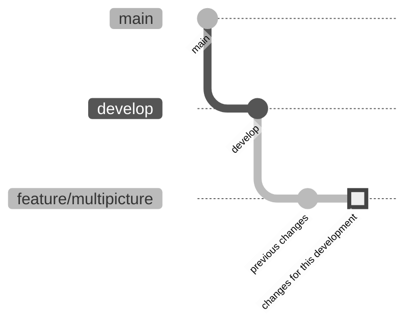
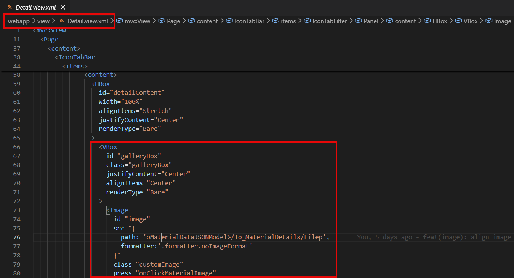

# Material Enrichment Multiple Images design

> [[index]]>[[ep5]]

## Requisites

Material enrichment already show one image. First phase should allow the system to show multiple ones.

The URLs for the pictures will be retrieved from the business layer API that will get the URL from/for the [[ep1|Azure Image Manager]].

Also, each picture should show the description for it (if any) as a footer text.

## Repository

The repository is stored in Bitbucket: [Material Enrichment - YAP_SFS2_MAINT](https://bitbucket.org/schindlerglobal/yap_sfs2_maint/src/).

The branch used for this new developments is [feature/multipicture](https://bitbucket.org/schindlerglobal/yap_sfs2_maint/src/fae5f7b89805aa1946f7decdbe63c59b04ea52a1/?at=feature%2Fmultipicture).

> [!CAUTION]Please, use that branch or create a new one forking from this one. There are already some changes developed in it that should be implemented together with the new ones.



### Commiting

This repository is prepared to fulfill the [convetional commits messages](https://www.conventionalcommits.org/en/v1.0.0/#summary).

Use:

- **feat** for feature changes in the functionality
- **refactor** for refactoring changes (no change in funcitonality)
- **docs** when updating any documentation
- **fix** when the changes are related to fix
- **chore** for any cleaning process in the setting files

Optionally, you can add the topic between with brackets.

Here some example:

```JS
git commit -m "feat(detail): add new carousel for images"
git commit -m "chore(npm): update npm dependencies"
git commit -m "refactor: clean oData calls following guidelines"
```

> [!WARNING]If the commit message is not properly built, the system will not allow to proceed with the commit.

> [!TIP]Most of the changes done during this developments would use 'feat'

## Technical specs

The image is being shown in the Material details view:


Currently there is only one image being retrieved through the OData service:

```
oMaterialDataJSONModel>/To_MaterialDetails/Filep
```

We need to creata mock-up (as the APIs are not defined yet) of an array of pictures and their description:

```JS
imageArray = [
  {
    image_path: 'URL_1'
    description: 'Description_A'
  },
  {
    image_path: 'URL_2'
    description: 'Description_B'
  }
]
```

The carousel should show both of them, Image and descriptions:

```
--------------     --------------
|            |     |            |
|   Image    |     |   Image    |
|            |     |            |
--------------     --------------
Description_A       Description_B
```

### Proposed Fiori Elements

SAP UI5 already have the carousel component that can be used for this. [Here](https://ui5.sap.com/#/entity/sap.m.Carousel) you can find some examples.

As we need to show Image and Description, probably this example would fit the best: [Carousel with Multiple Items at Once](https://ui5.sap.com/#/entity/sap.m.Carousel/sample/sap.m.sample.CarouselWithMorePages).
