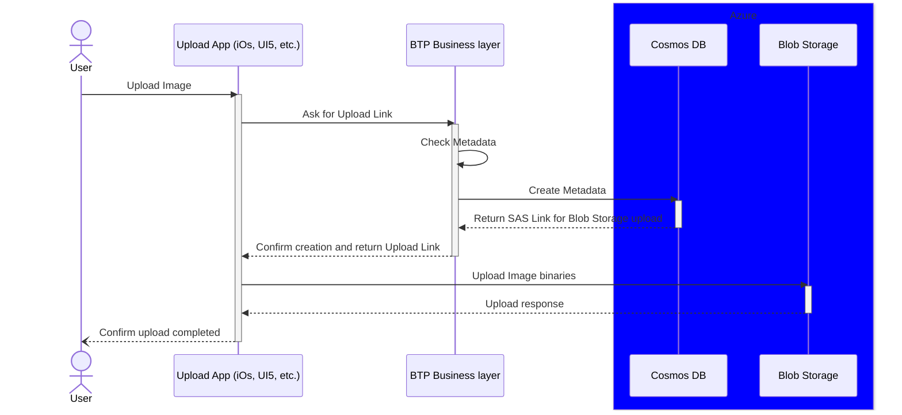

# API for material business logic

This will act as the business logic layer before accesing the Image Manager.

This should be able to communicate with the Image Manager to get the upload URL and to manage metadata saving and retrieving.

## Upload of new picture

This API should have an endpoint to prepare the upload and to save the metadata.

### Check metadata

The first step is to check the metadata received.

- Material exists in PE1
- Metadata is correct (tbd)

### Save metadata

Once it's checked, the Image manager is called to save it.

### Get SAS Link for upload

Then it's required to get an upload link to Azure. It will be a pre-signed link so there is no auth required by the user/client uploading the picture.

The link should live only for 5 minutes (or less depending on future performance measures).

### Return the new image ID and the URL for the upload

The new Id generated by the Image Manager and the URL for the upload are returned to the client so they can proceed with the direct upload in the blob storage.

_PUT <UPLOAD_URL>_

This avoid having the binaries traveling throught different layers/nodes that could affect latency.

## Consume/download images

#todo
